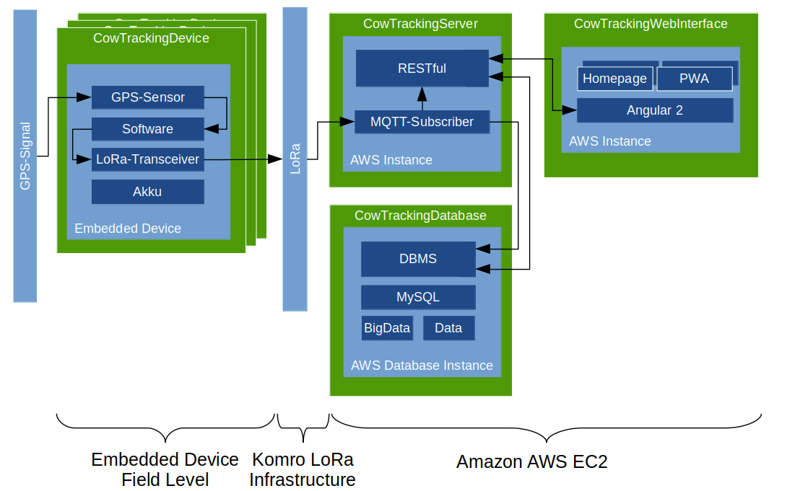

Note:

Eigenes Logo!

---

### Cowtracking?

Note:

Bauer sucht Kuh.  
Cowtracking ist die Lösung.

---

### Cowtracking!

Note:
- Full-Stack-Anwendung  
- Im grunde 3 Projekte  

---

### Cowtracking!

Note:
KUHle Webseite

---

### Ergebnis

Note:
- Haben working demo!
- tatsächliche Leistung -> Feldtests

---

@snap[midpoint span-30]
## Fragen? Erste Tür links!

@snapend

Note:
Demo am Stand
