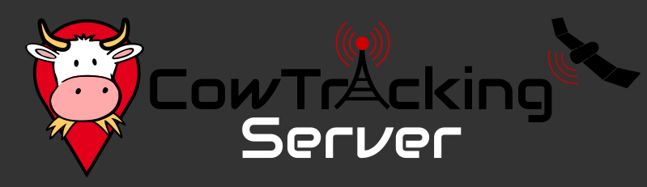
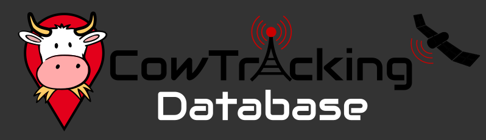
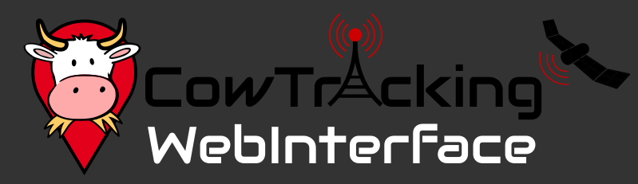

# Abschlusspräsentation 

Note:

Zur Wiederholung -  was ist Cowtracking?

---

### Cowtracking?

Note:

Bauer sucht Kuh. Cowtracking ist die Lösung.

---

## Agenda

@ul
- Rückblick: Beginn und Zwischenpräsentation
- Verlauf und Stand
- Demo
- Fragen
@ulend

Note:

Anforderungen, MVP, Feedback Zwischenpräsi  
Für Device, Server, WebInterface, Tests  
(live-)Demo  
Zeit -> Fragen am Schluss

---

## Anforderungen

---

## MVP

---

## Komponenten

---

## CowTrackingDevice

+++

Folie 1

Note:

Notizzeile 1  
2

---

## CowTrackingServer

+++

Folie 1

Note:

Notizzeile 1  
2

---

## CowTrackingDatabase

+++

Folie 1

Note:

Notizzeile 1  
2

---

## CowTrackingWebInterface

+++

Folie 1

Note:

Notizzeile 1  
2

---

## Tests

+++

Folie 1

Note:

Notizzeile 1  
2

---

## Demo!

---

@snap[midpoint span-30]
## Fragen?

@snapend
