# Abschlusspräsentation 

Note:

Zur Wiederholung -  was ist Cowtracking?

---

### Cowtracking?

Note:

Bauer sucht Kuh.  
Cowtracking ist die Lösung.

---

## Agenda

@ul
- Rückblick: Beginn und Zwischenpräsentation
- Verlauf und Stand
- Demo
- Fragen
@ulend

Note:

Anforderungen, MVP, Feedback Zwischenpräsi  
Für Device, Server, WebInterface, Tests  
(live-)Demo  
Zeit -> Fragen am Schluss

---

### Anforderungen
@ul
- Device
- LoRa
- Standorte anzeigen
@ulend

Note:

Gerät an Kuh  
LoRa für comm Device<->Infra
Standorte für Landwirt

---

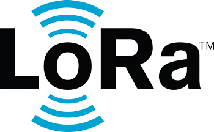

Note: 
* Rechte hält SemTech aus USA -> proprietär  
* kabellose Übertragungstechnik  
* geringer Energieverbrauch + geringe Datenrate (0.3 -50 kib/s)  
    + hohe Reichweite (50 km in offenem Gelände)  
* um Netzwerk aufzubauen -> LoraWAN (WideAreaNetwork)   
* koordiniert von Lora Alliance (500 Mitglieder)  
* größere Netzwerke zB in Schweiz und Südkorea  
* ganz aktuell 21.01 -> Aufnahme eines lora-treibers in den LinuxKernel  
    -> Zukunft ist gegeben

---

### Minimum Viable Produkt

+++

### MVP
@ul
- Device: GNSS, LoRa
- über Brocaar...
- an Server...
- in Datenbank...
- auf Webseite!
@ulend

Note:

Dev: ergonomie, auto-send, akku  
Srv: in DB, an Front, in cloud  
DB: persistent  
Front: Darstellen, mobil+Desktop

---

## Komponenten

---

## CowTrackingDevice

+++

### Überblick

+++

### Auswahlprozess
@ul
- Arduino MKRWAN-1300
- Netblocks XRange LoRa
- STM32L0B-L072Z-LRWAN1
@ulend

Note: 
XRange GNSS-Modul anbinden  
STM32 bekannter Manufacterer  
* zertifizierter LoRa-Stack  
* Tutorials STM32CubeMX  
* Toolchain + Packages nicht aufgesetzt bekommen  
* compilen _>  mbed-online-compilers  
* Zeitplan -> Iden des Dezembers  

Arduino
* bekannt aus Vorlesung  
* nicht zertifiziert

+++

@snap[north]
### Programmierung
@snapend

@snap[east]

@ul
- Serielle Verbindung zwischen GNSS-Modul und Arduino
- Möglichkeit zum anzeigen und ändern der Verbindungsdaten
- Sendezyklus:
@ol
    - Abfrage der Position und Verpackung in die Payload
    - Verbindungsafbau zum Gateway
    - Senden der Daten
    - Auslösen eines über RTC gesteuerten Interrupts
@olend
@ulend

@snapend

@snap[west span-30]
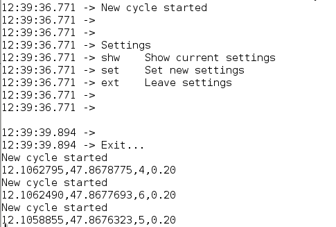
@snapend

+++

### GNSS Modul

@ul
- Sehr später Lieferzeitpunkt
- Aufwendige Einstellungsmöglichkeiten
- Verwendung von GPS und Galileo
- Relativ genaue Ergebnisse (~ 15m)
- Trotz Energiesparmodus hoher Verbrauch des Moduls
@ulend

Note:
- Auf Windows eine recht schlechte Anwendung  
- Auschluss von GLONASS gefordert  

+++

### CowTrackingCase

@ul
- Mit TINKERCAD entwickelt
- Mit 3D Drucker aus RoLip gedruckt
- Demo
@ulend

Note:
- Probleme mit FreeCAD  
- Verzögerung bei Endmontage aufgrund von später Festlegung auf Arduino  

+++

### Lessons Learned Chris
@ul
- nur mit Arduino gearbeitet 
- keine Tutorials für schnellen Einstieg
- Einarbeitung in LoRa erforderlich
@ulend

Note:
* nur Arduino bekannt -> kein Programmer  
* IDE mit Paketen aufsetzen (was braucht ich eigentlich)  
* verwirrende Vielfalt an ähnlichen Produkten  
* keine Communityunterstützung  
* Grundproblem Teamaufteilung -> 2 Leute für 3 Boards inkl. Evaluierung und Programmierung nicht machbar in Zeitrahmen  
    * zusätzlich Einarbeitung in lora-Stack nötig (Spec lesen und   
    praktische Umsetzung verstehen)

+++

### Lessons Learned Tom
@ul
- Im akkubetriebenen IoT Bereich ist GNSS ein Problem
- Hardware-Evaluation kürzer halten
- Mit bekannten Technologien arbeiten
- Viele neue Erkenntnisse gesammelt
@ulend

---

## CowTrackingServer

+++

### CowTrackingServer
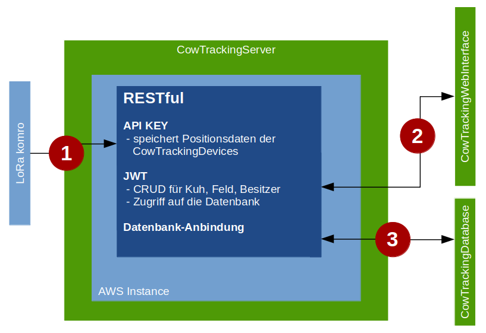

+++

@snap[north]
### Cloud
@snapend

@snap[west sidebar]

@snapend

@snap[east sidebar]
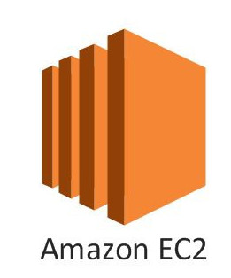
@snapend

@snap[south]
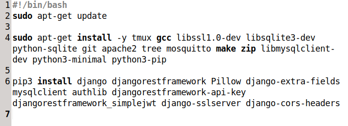
@snapend

+++

@snap[midpoint]
### Frameworks
  
  
  
@snapend

+++

### Pakete und Module

@ul
- JWT
- API-KEY
- CORS
- SSL
@ulend

+++

### Code-Ausschnitt
  

---

## CowTrackingDatabase

+++

@snap[midpoint]
### CowTrackingDatabase
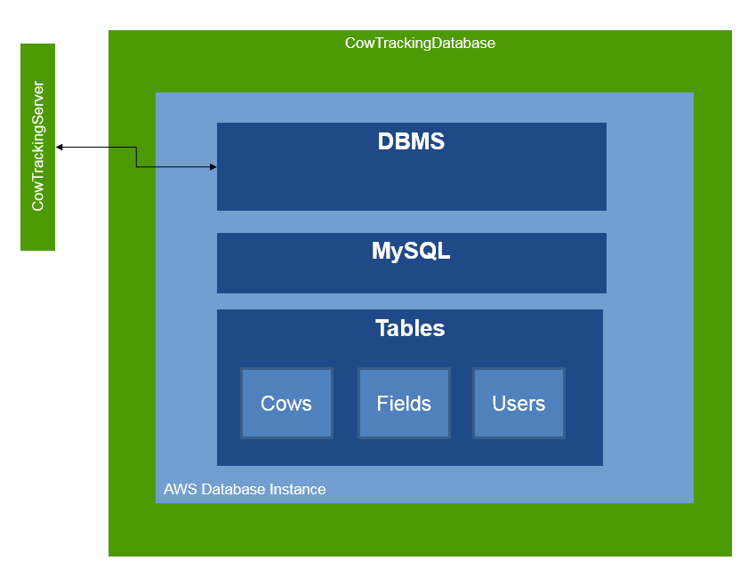
@snapend

+++

### Technologie
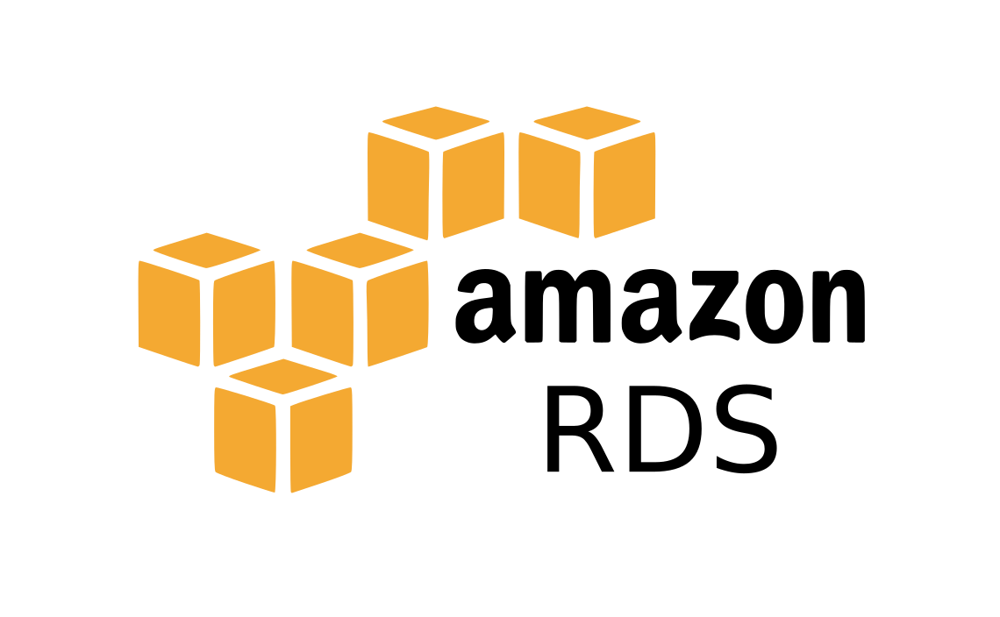

+++

@snap[midpoint]
### Technologie

@ul
- Schnellere und einfachere Einarbeitung und Nutzung
- Ausführlichere Dokumentation
@ulend
@snapend

+++

### Datenbankmodell
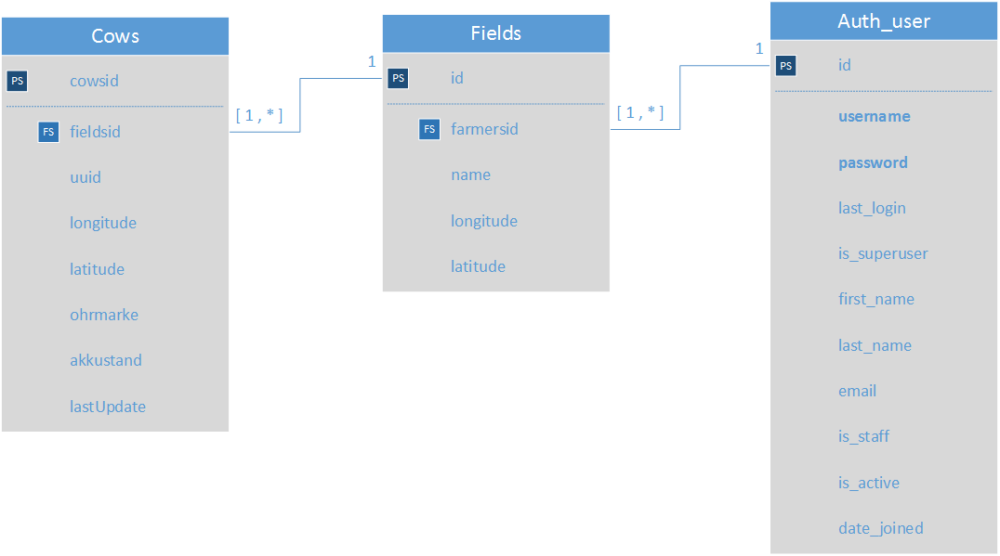

---

## CowTrackingWebInterface

+++

### Umsetzung

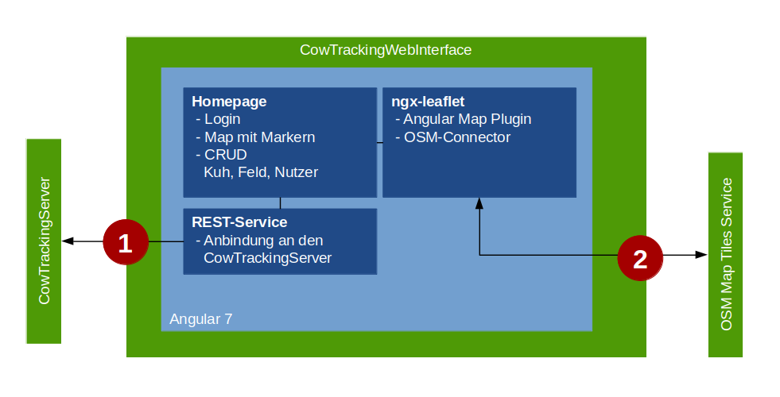

Note:

* Material Design! -> TO PRITZL
* Synergien aus anderem Projekt genutzt  
* Schnittstelle FrontEnd-Backend und Server 
* Services und Interceptoren

+++

### Ergebnis

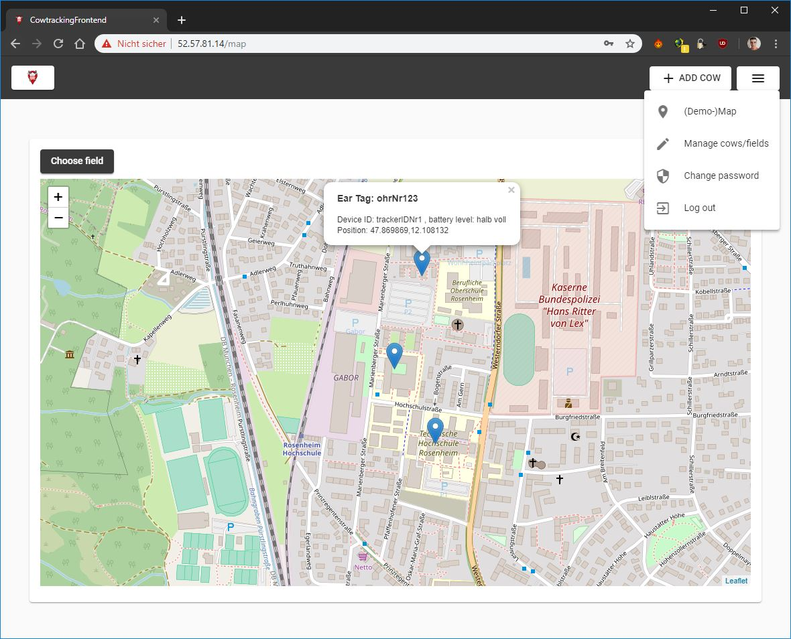

+++

### ToDo

@ul
- Bugfix
- Refactoring
- Kuh & Feld-Management
- Websockets
- Progressive Web App
@ulend

Note:

Marker auf Mobile  
Fertig -> will neu machen  
CUD cow + Field  
polling weg, sockets her  

---

## Tests

+++

@snap[north]
### Teststrategie
@snapend

@snap[west span-70]
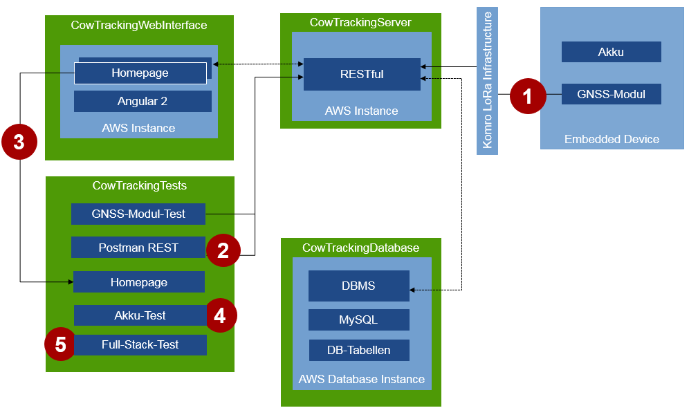
@snapend

@snap[east span-50]
@ul
- GNSS-Modul
- REST-Schnittstelle
- Web-Interface
- Batterie
- Full-Stack-Test
@ulend
@snapend

+++

@snap[west span-50]
Test an der TH
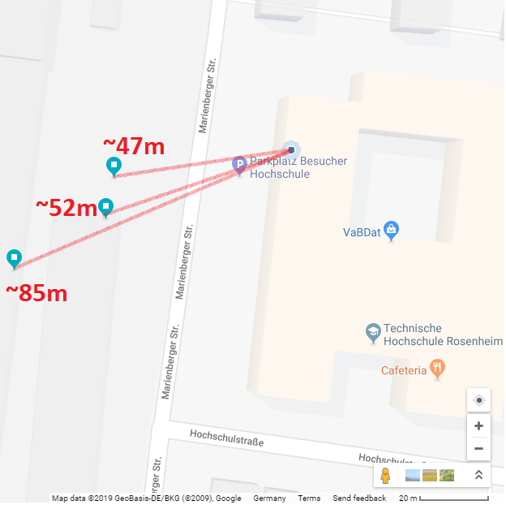
@snapend

@snap[east span-50]
Test in der Innenstadt
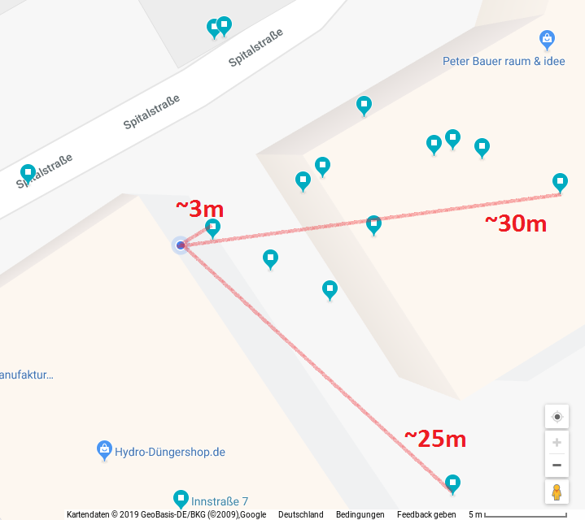
@snapend

+++

### GNSS-Modul: Testergebnisse

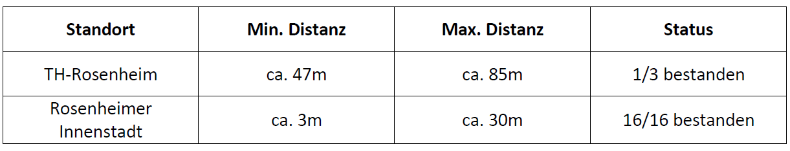

+++

@snap[north]
### Test der REST-Schnittstelle
@snapend

@snap[north-east span-30]

@snapend

@snap[west span-50]
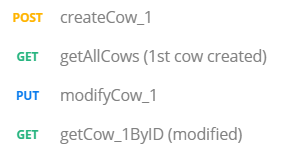
@snapend

@snap[east span-70]
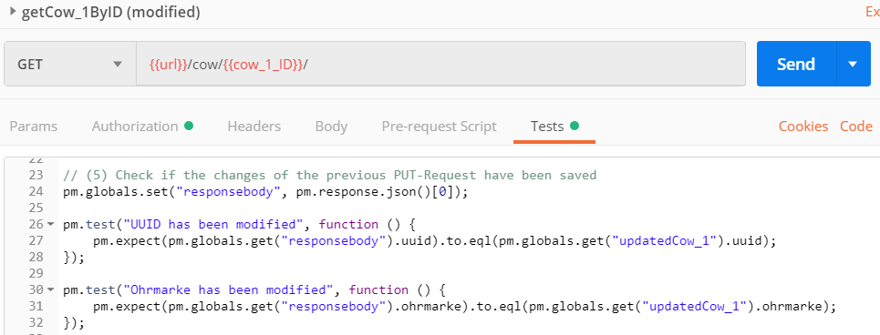
@snapend

+++

@snap[midpoint span-100]
### REST-Schnittstelle: Testergebnisse
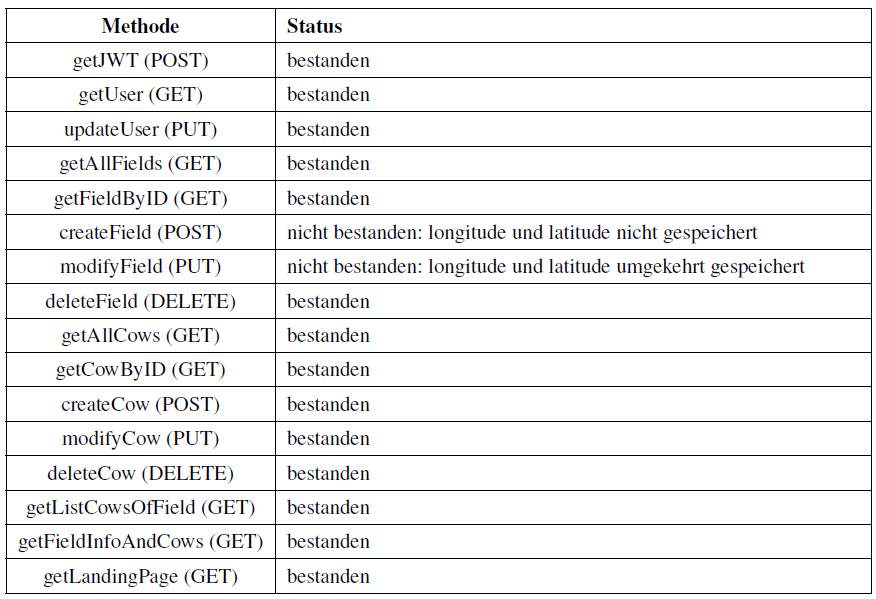
@snapend

+++

@snap[west span-50]
### Test des CowtrackingWebInterface
Für jeden Testfall: 
@ul
- Vorbedingungen
- Testdurchführung
- Ergebnisse der Testdurchführung
@ulend
@snapend

@snap[east]
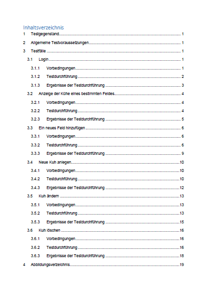
@snapend

+++

### Web Interface: Testergebnisse

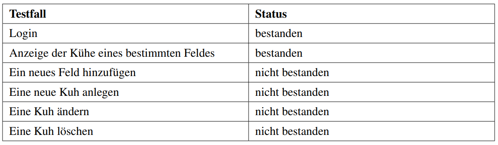

+++

### Abschätzung der Batterielaufzeit

Gesamtstromverbrauch des Devices:
@ul
- Betriebmodus: 24000 mA
- Schlafmodus: 9000 mA
@ulend

+++

### Abschätzung der Batterielaufzeit

Laufzeit der Batterie bei 2,5 Ah:
@ul
- Betriebmodus: ca. 4 Tage
- Schlafmodus: ca. 12 Tage
@ulend

+++

### Full-Stack-Test
Werden die Koordinaten in die Datenbank gespeichert?]

+++

### JA!
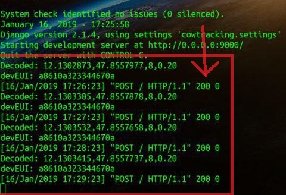

---

## Demo!

Note:  

http://52.57.81.14

---

@snap[midpoint span-30]
## Fragen?

@snapend
